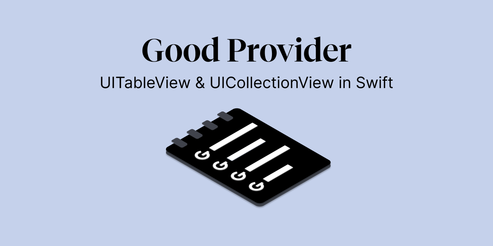
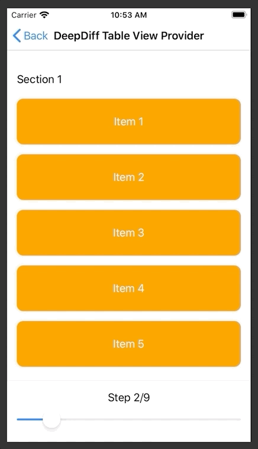
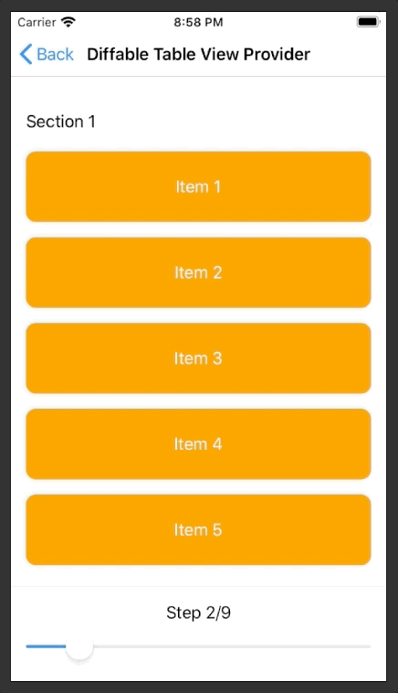

# GRProvider
[]() [](https://docs.swift.org/swift-book/)
[]()
[]()
[](#swiftpackagemanager)

## Table of content

*  [Why to use?](#why-to-use)
*  [How to use?](#how-to-use)
    * [Define model](#define-model)
    * [Create the instances](#create-the-instance-of-table-view-and-provider-you-choosel)
    * [Setup](#setup-provider)
    * [Show items](#show-items-in-table-view)
    * [Basic sample](#all-together)
*  [Features](#features)
    *  [Table View Provider](#table-view-providers)
    *  [Collection View Provider](#collection-view-provider)
*  [Animations](#animating-differences)
*  [Are you missing some property configuration?](#are-you-missing-some-property-configuration)
*  [Installation](#installation)
*  [License](#license)

## Why to use?
Writing the simple scanario, where you want to use the basic implementation of the UITableView or UICollectionView is tedious. 
You have to implement a lot of delegate methods, even for the simplest use-case.
I
Example:  `UITableViewDiffableDataSource` accessible in **iOS 13** is a simple approach of loading/diffing data in TableView 

Learning curve is a little bit tedious, but it's worth for the future programing.

**👍 Advantages:**
- immutable data binding
- one source of the truth
- no need to do the custom diffing mechanism
- avoids synchronization bugs, exceptions and crashes
- avoids side effects
- uniform approach accross all providers
- simple usage of animations using provider with **DeepDiff** library or provider using `UITableViewDiffableDataSource`

**👎 Disadvantages:**
- learning curve
- Not a good solution for the complicated/advanced usa case of the TableView or CollectionView
- different approach than the standard Apple iOS API
- usage of the third part diffing library DeepDiff
- contains only the most used delegates methods 
- still in the **development** process

Look at this simple code you just need to write, to show data in Table View:
```swift
lazy var tableProvider = GRSimpleTableViewProvider<Int> { provider, tv, indexPath, item in
    guard let cell = tv.dequeueReusableCell(fromClass: SimpleTableViewCell.self, for: indexPath) else { return UITableViewCell() }
    cell.titleLabel.text = "Item with value: \(item)"
    return cell
}

private func showItems() {
    tableView.items(tableProvider, items: [1, 2, 3, 4, 5, 6, 7], animated: true)
}
```
That's all you need to do, when showing simple data in the **TableView**. 
Isn't that great? That's all you need to do. 

No need of:
- assigning `tableView.delegate = self` & `tableView.dataSource = self` 
- implementation of any DataSource/Delegate methods
- No need of casting/accessing the cell item property in collection (Arrays etc.)


## How to use?

You can use this type of GRProviders:
1. `GRSimpleTableViewProvider` -> Use in case of you have just one section in the `UITableView`
2. `GRTableViewProvider` -> Default provider for the `UITableView`
3. `GRDiffableTableViewProvider` -> Inherits all functionality of `GRTableViewProvider` but uses `UITableViewDiffableDataSource` API for diffing and animating
4. `GRDeepDiffTableViewProvider` -> Inherits all functionality of `GRTableViewProvider` but uses `DeepDiff` framework for diffing and animating. More info about framework [click here](https://github.com/onmyway133/DeepDiff).
5. `GRCollectionViewProvider` -> Default provider for the CollectionView
6. `GRDeepDiffCollectionViewProvider` -> Inherits all functionality of `GRCollectionViewProvider` but uses `DeepDiff` framework for diffing and animating. More info about framework [click here](https://github.com/onmyway133/DeepDiff).
7. `GRDiffableCollectionViewProvider` -> CollectionView provider that uses `UICollectionViewDiffableDataSource` as a data source and leaves the layout handling for `collectionViewLayout`. It is recommended to use this provider alongside `UICollectionViewCompositionalLayout` or any custom layout.

#### Define model 
Firstly you need to model your data, showed in the `UITableView` or `UICollectionView` using any type you choose.

For example:

```swift
/// using Enum as Section & Class as Item
enum Section: Sectionable {
        
    case sectionOne([Item])
    case sectionTwo([Item])

    struct Item {
        let title: String       
    }
    
}

/// using Class as a Section & Enum as an Item
class Section: Sectionable {
    let items: [Item]
    
    enum Item {
        case title
        case divider
        case advertisement
    }
    
}

/// Define only items without sections
enum Item {
    case title
    case divider
    case advertisement
}

```
You can model it, based on your preference. It's all up to you.

#### Create the instance of the `UITableView` and `provider` you choose

```swift

@IBOutlet weak var tableView: UITableView!
private let tableProvider = GRSimpleTableViewProvider<Item>()

```

#### Setup your provider

```swift

private func setupTableProvider() {            
    tableProvider.configureCell = { provider, tableView, index, item in              
        switch item {
        case .advertisement:
        return tableView.dequeueReusableCell(....)
        case .divider:
        return tableView.dequeueReusableCell(....)
        case .title:
        return tableView.dequeueReusableCell(....)
        }                   
    }
}

```

#### Show items in the `UITableView`

```swift

private func showItems() {            
    let items: [Item] = [.title,
                         .divider,
                         .advertisement,
                         .divider,
                         .advertisement]
                         
    tableProvider.bind(to: tableView, items: items)
}

```
🔥 That's it. All you need to do to show the simple list with 2 advertisements and title in few lines of code. 🔥

#### All together
Show list of strings in table view.
```swift

import UIKit
import GRProvider

class ViewController: UIViewController {

    @IBOutlet weak var tableView: UITableView!
    
    private let tableProvider = GRSimpleTableViewProvider<String>()
    
    override func viewDidLoad() {
        super.viewDidLoad()
        title = "Simple Table View Provider"
        
        setupTableView()
        showItems()
    }

    private func setupTableView() {
        tableProvider.estimatedHeightForRow = 100
                
        tableProvider.configureCell = { _, tv, index, title in
            guard let cell = tv.dequeueReusableCell(fromClass: SimpleTableViewCell.self, for: index) else { return UITableViewCell() }
            cell.titleLabel.text = title
            return cell
        }
    }
    
    private func showItems() {
        let items = (1...10).map { "Item \($0)" }
        tableProvider.bind(to: tableView, items: items)
    }
    
}

```

>[!WARNING]
> ⚠️⚠️⚠️  **Retain cycle**: Be careful when using strong reference inside the closure. In case you need to call  `self` inside the closure, don't forget to use `[unowned self]` or `[weak self]`

## Features
### UITableView Providers

You can choose one of these types of providers:

1. `GRSimpleTableViewProvider` -> Use in case of you have just one section in the `UITableView`
2. `GRTableViewProvider` -> Default provider for the `UITableView`
3. `GRDiffableTableViewProvider` -> Inherits all functionality of `GRTableViewProvider` but uses `UITableViewDiffableDataSource` API for diffing and animating
4. `GRDeepDiffTableViewProvider` -> Inherits all functionality of `GRTableViewProvider` but uses `DeepDiff` framework for diffing and animating. More info about framework [click here](https://github.com/onmyway133/DeepDiff).

**Features:**

1.  `estimatedHeightForRow: CGFloat`   
Setup default estimated height of the dequeued cell.
2. `configureEstimatedCellHeight: CellHeightProvider` 
You can provide different height estimation for each cell separatelly.

```swift
tableProvider.configureEstimatedCellHeight = { _, _, _, item in
    switch item {
    case .advertisement:
        return 100
    case .divider:
        return 1
    case .title:
        return 24
    }
}
```
3.`configureCellHeight: CellHeightProvider` 
You can provide different height for each cell separatelly.
```swift
tableProvider.configureCellHeight = { _, _, _, item in
    switch item {
    case .advertisement:
    return UITableView.automaticDimension
    case .divider:
        return 1
    case .title:
        return 24
    }
}
```
4. `configureCell: CellProvider`
Configuration for dequeueing cell based on the model provided in the provider instance.
```swift
tableProvider.configureCell = { provider, tableView, index, item in              
    switch title {
    case .advertisement:
    return tableView.dequeueReusableCell(....)
    case .divider:
    return tableView.dequeueReusableCell(....)
    case .title:
    return tableView.dequeueReusableCell(....)
    }                   
}
```
5. `configureSectionHeader: SectionHeaderFooterProvider` & `configureSectionFooter: SectionHeaderFooterProvider`
Returns `UIView` showed in the header or te footer.

```swift
tableProvider.configureSectionHeader = { provider, section in
    let container = UIView()
    let label = UILabel()
    label.translatesAutoresizingMaskIntoConstraints = false

    container.addSubview(label)

    label.topAnchor.constraint(equalTo: container.topAnchor, constant: 15).isActive = true
    label.leftAnchor.constraint(equalTo: container.leftAnchor, constant: 15).isActive = true
    label.bottomAnchor.constraint(equalTo: container.bottomAnchor, constant: -15).isActive = true
    label.rightAnchor.constraint(equalTo: container.rightAnchor, constant: -15).isActive = true

    label.text = provider.sections[section].title

    return container
}
```
> ⚠️ Don't forget to setup height of the header. Ex: `tableProvider.heightForHeaderInSection = UITableView.automaticDimension`

6. `configureSectionHeaderHeight: SectionHeaderFooterHeightProvider`  &  `configureSectionFooterHeight: SectionHeaderFooterHeightProvider` & `heightForFooterInSection: CGFloat` & `heightForHeaderInSection: CGFloat`
You can use one of the property from the list about, to configure height for the footer or the header in the section. In case you want to have different sizes use `configure` methods. Otherwise use  `heightForFooterInSection` and `heightForHeaderInSection`.
7. `configureOnItemSelected: ItemSelectionProvider`
One of the most used property in the provider. Setup the closure variable to be notified about the selection on the cell.
```swift
tableProvider.configureOnItemSelected = { [unowned self] _, _, _, item in
    switch item {
    case .advertisement:
        print("Advertisement clicked")
    case .divider:
        print("Advertisement clicked")
    case .title:
        print("Title clicked")
    }
}
```
8. `configureTrailingSwipeGesture: SwipeGestureProvider` & `configureLeadingSwipeGesture: SwipeGestureProvider`
10. `configureDidScroll: ScrollProvider`
9. `configureRefreshGesture: ScrollProvider`
Closure is fired, when the table view contains the refresh control. When `scrollViewDidEndDragging` executes, it automatically checks the refresh control `isRefreshing` property and fires the event.
10. `configureDidEndDragging: DidEndDraggingProvider`
11. `configureWillEndDragging: WillEndDraggingProvider`

### UICollectionView Providers

You can choose one of these types of providers:

1. `GRCollectionViewProvider` -> Default provider for the `UICollectionView`
2. `GRDeepDiffCollectionViewProvider` -> Inherits all functionality of the `GRCollectionViewProvider` but uses the `DeepDiff` framework for diffing and animating. More info about the framework, [click here](https://github.com/onmyway133/DeepDiff)
3. `GRDiffableCollectionViewProvider` -> CollectionView provider that uses `UICollectionViewDiffableDataSource` as a data source and leaves the layout handling for `collectionViewLayout`. It is recommended to use this provider alongside `UICollectionViewCompositionalLayout` or any custom layout. Therefore some of the features as `cellSize`, `sectionInsets` and others are not available in this provider, selected `collectionViewLayout` should handle all the layout itself.

**Features:**

1. `configureCell: ItemProvider`
2. `configureCellSize: ItemSizeProvider`
3. `configureSupplementaryElementOfKind: SupplementaryViewProvider`
4. `configureSectionInsets: SectionInsetProvider`
5. `configureMinLineSpacingForSection: MinLineSpacingProvider`
6. `configureMinInteritemSpacingForSection: MinLineSpacingProvider`
7. `configureOnItemSelected: ItemSelectionProvider`
8. `configureDidScroll: ScrollProvider`
9. `configureRefreshGesture: ScrollProvider`
10. `configureWillEndDragging: WillEndDraggingProvider` & `configureDidEndDragging: DidEndDraggingProvider`
11. `cellSize: CGSize`
12. `sectionInsets: UIEdgeInsets`
13. `minimumLineSpacingForSection: CGFloat`
14. `minInteritemSpacingForSection: CGFloat`


## Animating Differences 

### GRDeepDiffTableViewProvider 
**DeepDiff** is a framework, used in past few years. It's fast with great benchmark against other alghoritms. More info about the library and alghoritm find [here](https://github.com/onmyway133/DeepDiff).

It works simillarly to the `GRDiffableTableViewProvider`, with same API but....

#### What is different?

1. Your Section/Item model definition must comform to the `DiffAware` protocol.
2. Constructor **doesn't** require instance of the `UITableView` unlike the `DeepDiffTableViewProvider`.
3. You can modify the animation for the insertion, deletion and replacement, what is not currently possible using the `DeepDiffTableViewProvider`.
4. Available for all versions of iOS starting iOS 11.



### GRDiffableTableViewProvider #iOS13
Apple has released the new API for animating differences in table views and collection views called `UITableViewDiffableDataSource`.
You can find the documentation [here](https://developer.apple.com/documentation/uikit/uitableviewdiffabledatasource).

**GRProvider** uses it's benefits and provides you a custom implementation benefitting on the `GRDiffableTableViewProvider`.
It uses the same API as other providers, so you don't need to worry about the learning curve. All providers shares their API.

#### What is different?

1. You Section/Item model definition must comform to the `Hashable` protocol.
2. Constructor of the `GRDiffableTableViewProvider` requires instance of the `UITableView` you will use in items binding.

These 2 things are required to animate your items differences in the table view. 



### GRDeepDiffCollectionViewProvider 
Similarly to [this section](#GRDeepDiffTableViewProvider)


## Are you missing some property configuration?

Just make a subclass of one of the providers and create aditional functionality. It's that simple.

> ⚠️ Be careful of overriding the current functionality. Use `super` to prevent misunderstanding. 

### For example

```swift
class CustomSimpleTableViewProvider<Section: Sectionable>: GRTableViewProvider<Section> {
    
    open var configureDidHighlightRow: ((CustomSimpleTableViewProvider, UITableView, Section.Item) -> ())?
    
    func tableView(_ tableView: UITableView, didHighlightRowAt indexPath: IndexPath) {
        configureDidHighlightRow?(self, tableView, sections[indexPath.section].items[indexPath.row])
    }
    
    override func tableView(_ tableView: UITableView, numberOfRowsInSection section: Int) -> Int {
        print("Number of rows for section: \(section)")
        return super.tableView(tableView, numberOfRowsInSection: section)
    }
    
}
```

# Installation
## Swift Package Manager

Create a `Package.swift` file.

```swift

import PackageDescription

let package = Package(
    name: "SampleProject",
    dependencies: [
        .Package(url: "https://github.com/smajdalf/GRProvider" from: "0.0.1")
    ]
)

```
If you are using Xcode 11 or higher, go to File / Swift Packages / Add Package Dependency... and enter package repository URL https://github.com/smajdalf/GRProvider, then follow the instructions

# License
GRProvider is released under the MIT license. See [LICENSE](LICENSE.md) for details.

